

# 软件用户手册

## 一、用户部分

### 1. 登录与注册

#### 1.1 注册界面
**功能：**  
新用户填写个人信息完成注册，注册包含用户名、密码等必填字段，底部提供“注册”按钮和“已有账号？立即登录”的跳转链接。

#### 1.2 登录界面
**功能：**  
顾客输入用户名和密码进行登录，底部提供“登录”和“注册”按钮，方便新用户跳转注册。
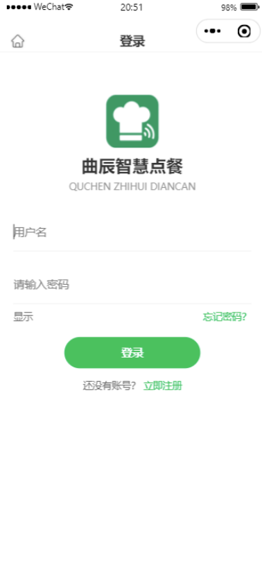
---

### 2. 个人中心

#### 2.1 个人主页
**功能：**  
展示顾客基本信息及常用功能入口，顶部显示头像、昵称，下方提供“我的订单”“我的收藏”“优惠卷”“投诉与建议”等功能入口。
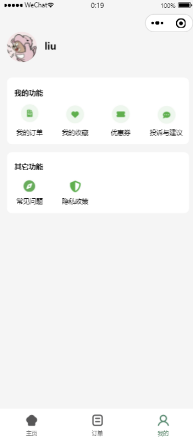
#### 2.2 个人中心
**功能：**  
编辑管理头像、用户名等个人信息。

#### 2.3 菜品收藏
**功能：**  
展示收藏菜品信息，支持顾客管理收藏的菜品。

#### 2.4 店铺评价
**功能：**  
顾客可对店铺进行文字性投诉与建议。
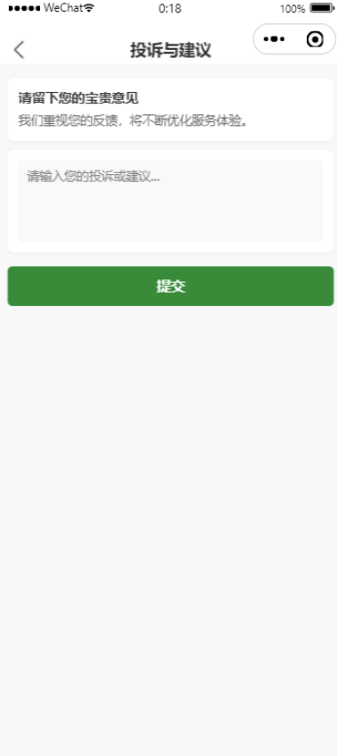
#### 2.5 优惠券中心
**功能：**  
分“全部”、“可用”、“已过期”三类展示顾客优惠券，每张券显示使用条件、有效期。
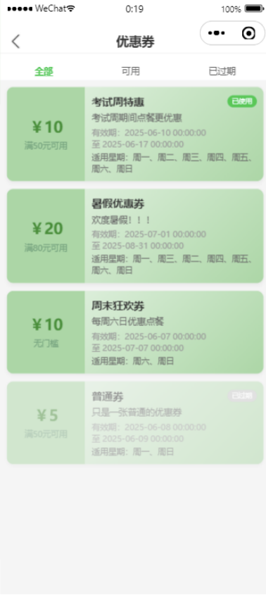
---

### 3. 菜品浏览与购买

#### 3.1 菜品主页
**功能：**  
- 顶部搜索框（支持关键词搜索菜品）  
- “扫码点餐”按钮（跳转扫码点餐界面）  
- 提供菜品分类标签（如“推荐”“热销”“主食”等）
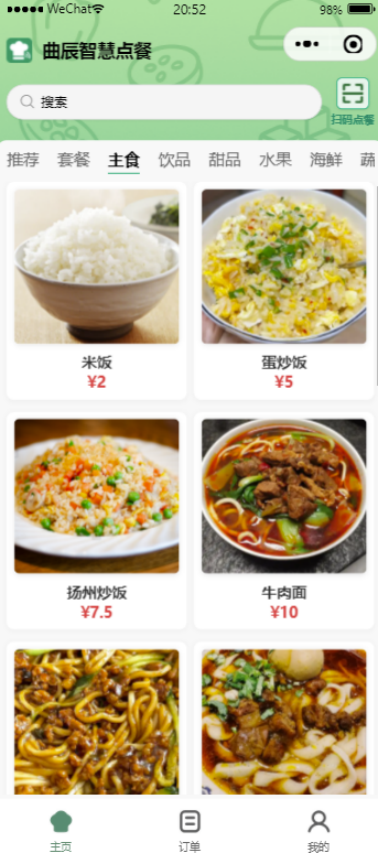
#### 3.2 菜品详情页
**功能：**  
点击菜品查看价格、图文描述与评价，并支持收藏操作。
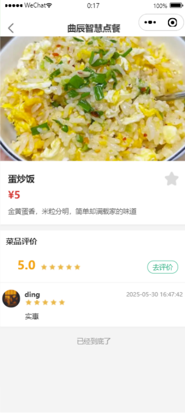
#### 3.3 菜品评价
**功能：**  
点击“去评价”按钮进入评价界面，支持星级评分与文字评价。

#### 3.4 菜品关键词搜索
**功能：**  
用户可在主页顶部搜索框根据关键词搜索菜品。

#### 3.5 购物车
**功能：**  
扫码进入点餐页面后可加购菜品。购物车展示菜品缩略图、名称、单价、数量与总价，支持全选、删除、结算操作，底部显示总金额与“下单”按钮。
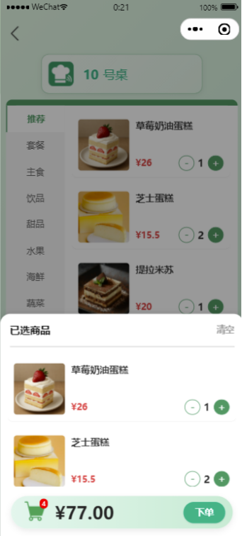
---

### 4. 订单管理

#### 4.1 订单列表页
**功能：**  
按“全部”“进行中”“已完成”“退款”等状态分类展示订单。每个订单展示编号、下单时间、餐桌号、菜品清单、订单状态及操作按钮（如“立即支付”“申请退款”等）。
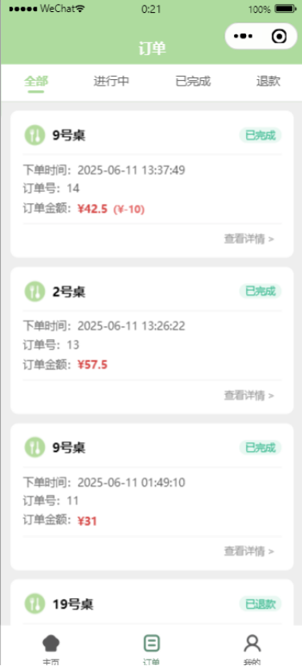
#### 4.2 “待餐中”订单详情页
**功能：**  
顾客不可修改订单或申请退款，如需更改须联系服务员。
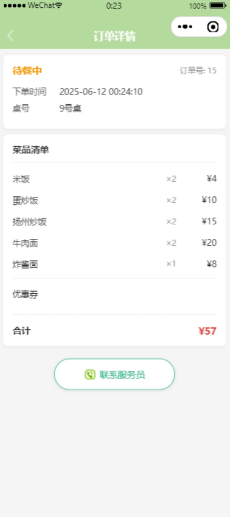
#### 4.3 “待支付”订单详情页
**功能：**  
顾客在商家上菜后可选择优惠券支付，遇疑问可联系服务员。
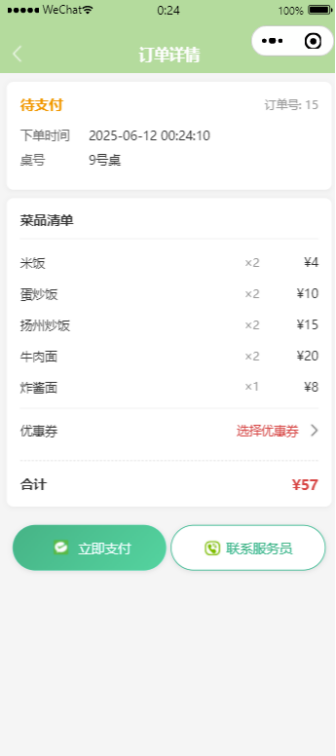
#### 4.4 “已完成”订单详情页
**功能：**  
顾客完成支付后订单状态为“已完成”，可申请退款。
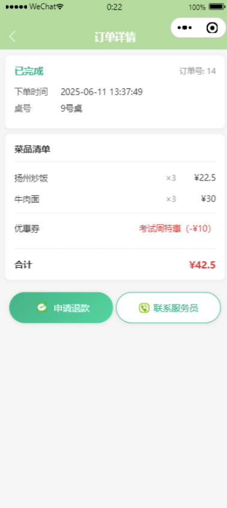
#### 4.5 “已退款”订单详情页
**功能：**  
退款后状态为“已退款”，使用的优惠券会返还顾客账号并在符合规则下可继续使用。
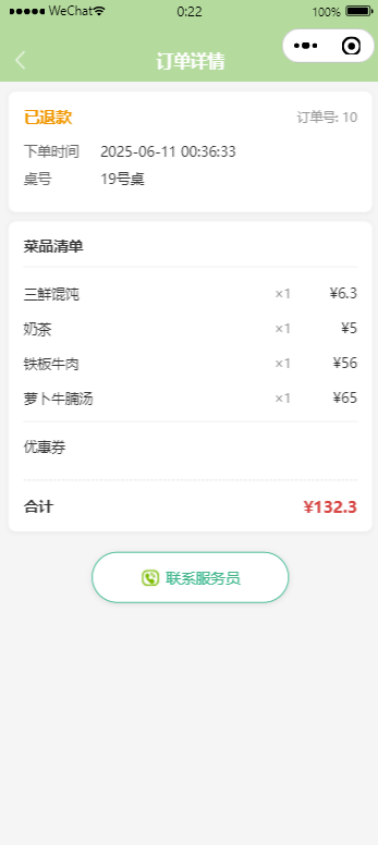
---

## 二、管理员部分

### 1. 登录界面
管理员和超级管理员通过此界面登录后台。超级管理员账号为系统自带，管理员账号由超级管理员创建。

---

### 2. 门店经营
**功能：**  
查看餐桌状态：
- 空闲（绿色）
- 点餐中（浅蓝）
- 待餐中（黄色）：可在当前界面操作订单  
- 待支付（深蓝）：支付后恢复为绿色
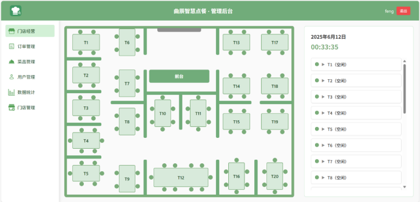
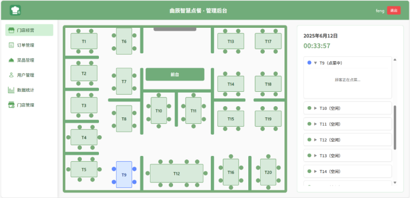
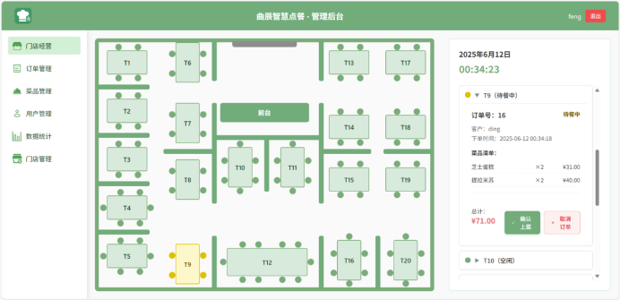
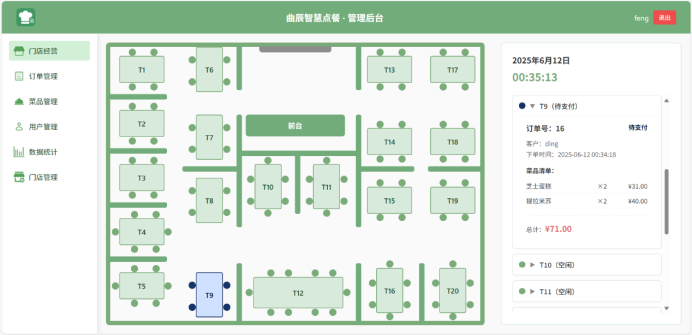
---

### 3. 订单管理
- **今日订单：** 可查看与搜索当日订单  
- **待处理：** 查看当前等待处理订单，可进行确认上菜或取消操作  
- **历史订单：** 可搜索所有历史订单
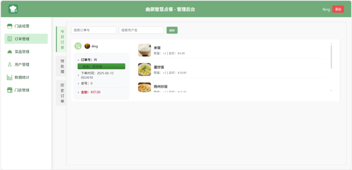
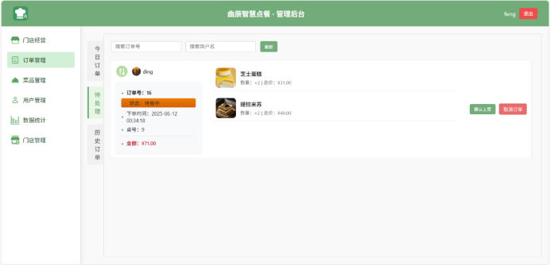
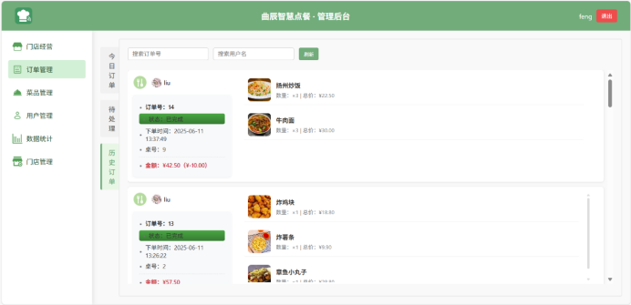
---

### 4. 菜品管理
- **菜品总览：** 查看、搜索、编辑所有菜品信息  
- **创建菜品：** 填写详细信息以创建新菜品  
- **套餐总览：** 查看、搜索所有套餐信息，支持编辑  
- **创建套餐：** 创建新套餐并填写其信息
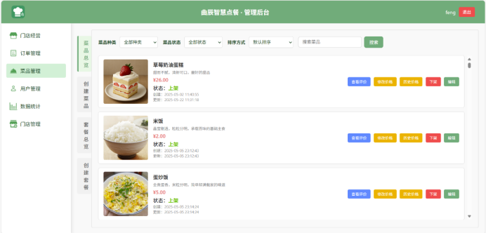
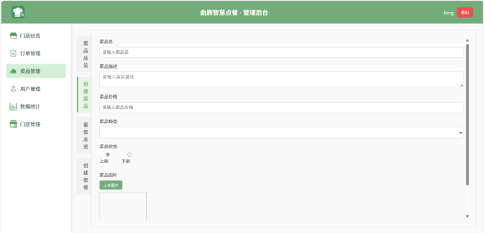
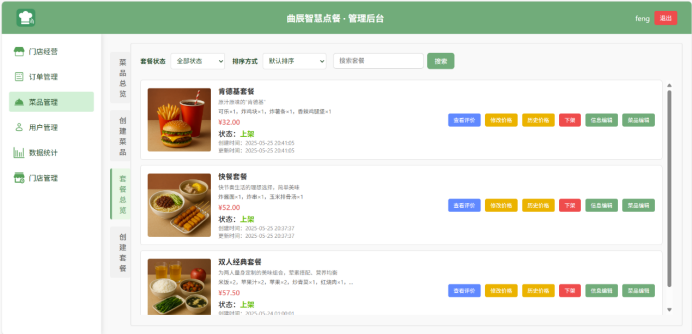
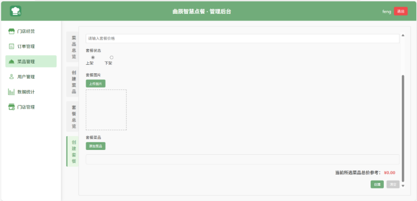
---

### 5. 用户管理
- **用户总览：** 查看、搜索所有账户，可发送优惠券  
- **发送优惠券：** 选择用户与具体优惠券后进行发送  
- **优惠券总览：** 查看、搜索所有优惠券  
- **创建优惠券：** 填写信息创建新优惠券
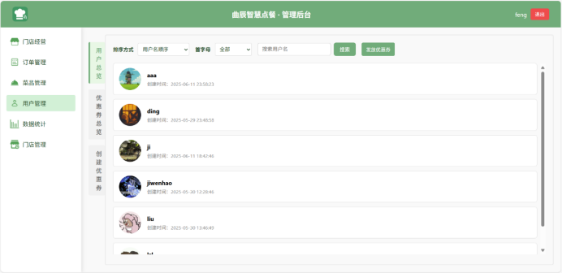
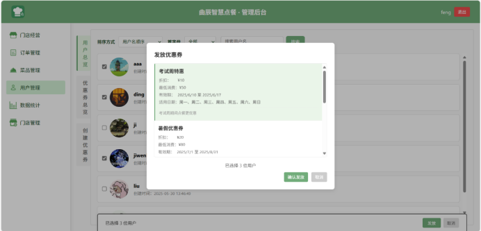
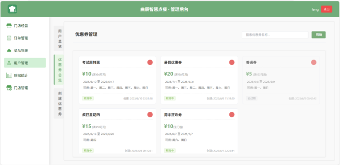
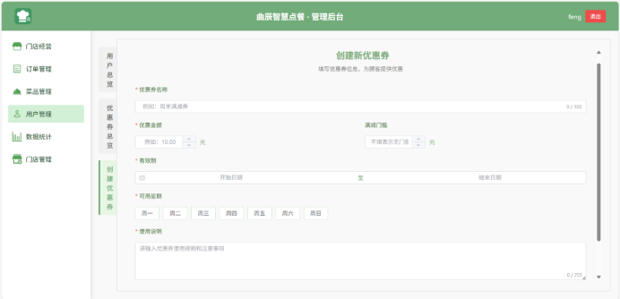
---

### 6. 门店管理
- **管理员栏：** 查看、修改管理员账号信息与状态  
- **二维码栏：** 查看各餐桌二维码（用于扫码点餐）  
- **门店评价栏：** 查看用户对门店的评价  
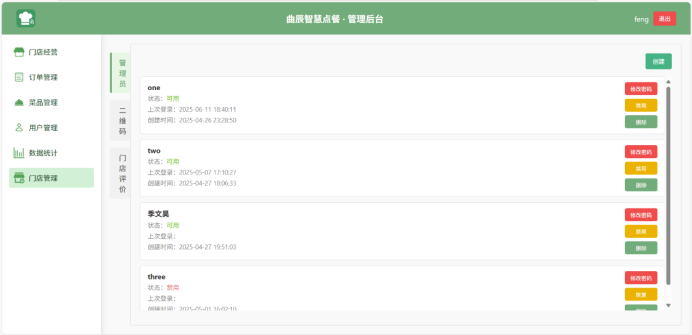
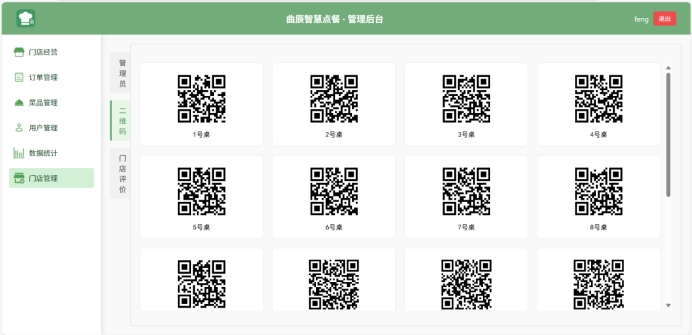
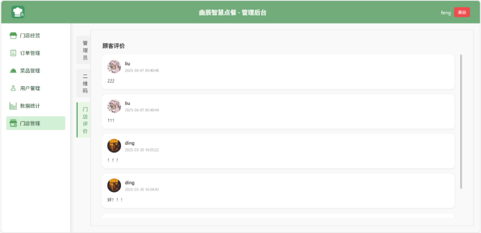
> ⚠️ 普通管理员无门店管理栏权限。